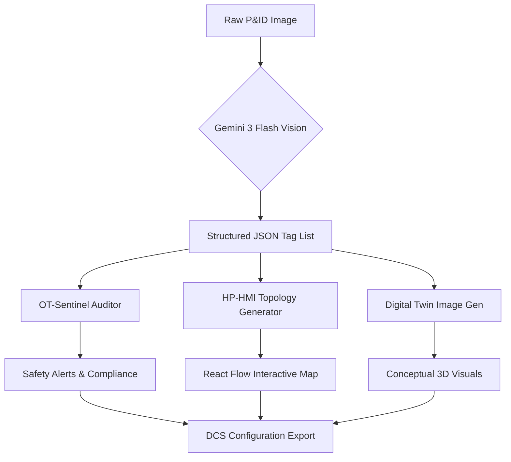

# Vision2DCS: AI-Powered P&ID to DCS Architect 🏭

Vision2DCS is a high-precision engineering tool designed for **Senior Automation & Process Control Engineers**. It leverages the **Gemini 3 Flash Vision Engine** to autonomously analyze Piping & Instrumentation Diagrams (P&IDs), extract instrument tag lists, and map them to industrial DCS standards like **Siemens PCS7 (APL)** and **ABB 800xA**.

## 🖼 Interface Preview

> [!TIP]
> **Capture high-quality screenshots** of the "P&ID View" and "HMI Topology" to populate your project documentation. The interface uses a "High-Performance HMI" (ISA-101) dark-mode theme.

## 🚀 Key Features

- **Multimodal AI Extraction**: Uses Gemini 3 to identify ISA-5.1 instrument bubbles, control valves, and signal lines from raw images (PNG/JPG).
- **Industrial Standards Mapping**:
  - **Siemens PCS7**: Auto-assigns block types like `MonAnL`, `VlvAnL`, and `MotL`.
  - **ABB 800xA**: Generates XML-compatible object mappings.
- **Interactive HP-HMI Topology**: Automatically generates a High-Performance HMI layout using `@xyflow/react`.
- **OT-Sentinel Safety Audit**: Built-in logic engine to detect "Orphan Signals" and naming violations.
- **✨ Digital Twin Concept**: AI-generated 3D conceptual renders of the process area based on extracted instrumentation.

## 🏗 System Architecture

## 🛠 Technology Stack

- **Core**: React 19 (Pure ESM)
- **AI**: Google Gemini 3 Flash Preview (Vision-to-JSON) & Gemini 2.5 Flash (Image Gen)
- **UI/UX**: Tailwind CSS + High-Performance HMI (ISA-101) design principles
- **Graph Engine**: `@xyflow/react` (React Flow) for topology mapping

## 📦 Installation & Setup

This project is designed as a **Native Browser ES Module** application.

1. Clone the repository.
2. Ensure you have `process.env.API_KEY` configured.
3. Serve using any static web server: `npx serve .`

---
*Developed for the next generation of Industrial Automation Engineers.*
